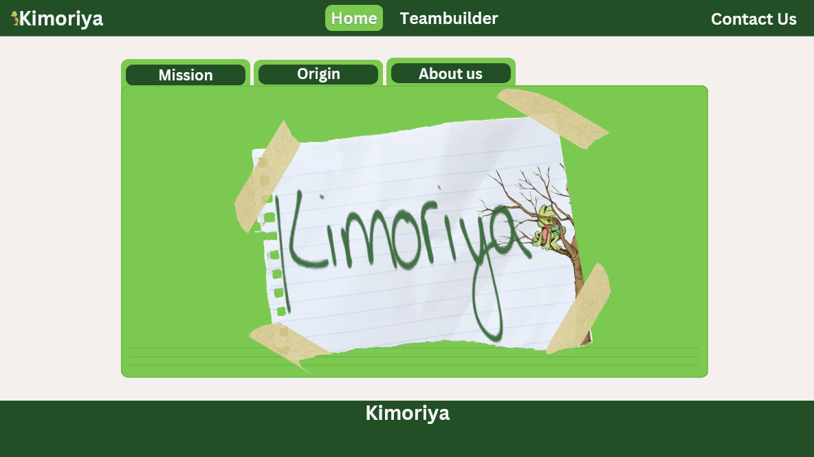
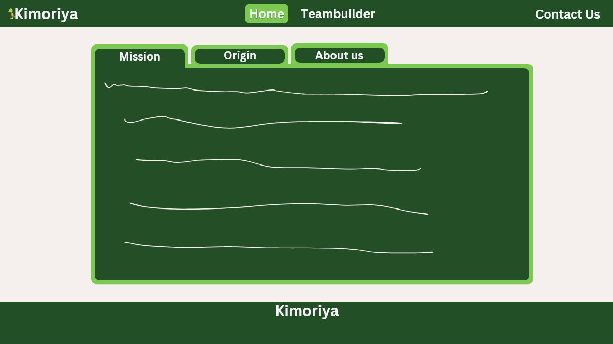
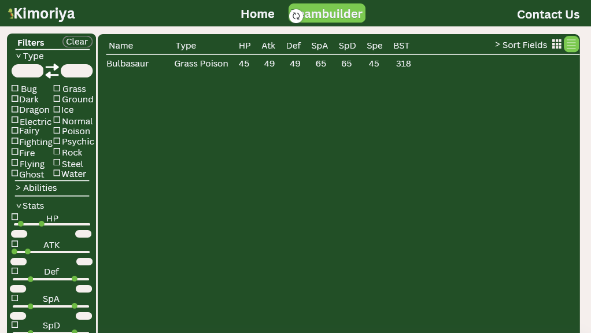

# Kimoriya

Welcome to **Kimoriya**, a web-based tool designed to help Pokémon trainers create themed teams by filtering Pokémon based on various attributes. Whether you are a casual player or a Pokémon fan looking for a more customised team, this tool will help you filter through a vast amount of Pokémon data efficiently.

## Table of Contents

* [Overview](#overview)
* [Deployment](#deployment)
* [Approach](#approach)
* [User Guide](#user-guide)
* [Stage Plans](#stage-plans)
* [Team](#team)

## Overview

**Kimoriya** is a thematic Pokémon team builder. It allows users to filter Pokémon by different criteria such as type, stats, abilities, and more. Initially, the project began as an idea on r/Pokemon, and although it was abandoned, the concept resonated with me, so I decided to bring it back to life.

## Deployment

Kimoriya is a web-based tool, so you can use it directly in your browser. Future stages will bring more advanced features, such as a Pokémon guessing game and advanced search filters.

The deployment will be available at [kimoriya.vercel.app](https://kimoriya.vercel.app).

## Approach

The main approach of the project is to create an intuitive, user-friendly tool where people can quickly find Pokémon based on specific attributes. It uses the PokeAPI to retrieve Pokémon data and supports filtering by attributes such as type, abilities, and stats.

## User Guide

Here is how you can start using Kimoriya:
1. Go to the **Pokemon Filter Page** to see the Pokémon list.
2. Use the filter options (checkboxes, dropdowns, and sliders) to customise your search.
3. You can reset or clear your filters any time to start a new search.

Future features include a Pokémon guessing game where users try to guess a Pokémon based on selected attributes.

## Stage Plans

Here is a breakdown of the development stages:

### Stage 1: Non-coded Mockups
- Plan basic layouts using Canva to visualise the tool before development begins.

### Stage 2: Basic Setup
- Set up the project structure with HTML, CSS, and React.
- Integrate PokeAPI to fetch Pokémon data.
- Develop a basic homepage and Pokémon filter page.

### Stage 3: Pokémon Filter Page
- Enhance the filtering system to support advanced criteria.
- Implement a dynamic list/grid view of Pokémon matching selected filters.

### Stage 4: User Interface Enhancements
- Improve UI/UX with better styling and interactivity.
- Optimise responsiveness for both desktop and mobile views.

### Stage 5: Testing and Optimisation
- Conduct user testing and performance optimisation.
- Implement feedback systems to refine features and address issues.

## Stage Progress

### Stage 1: Non-coded Mockups

  <strong style="font-size: 12px; padding-top: 12px;">"AI as enablers, not as the solution" ~Jayden 2024</strong>
   
  

  <strong style="font-size: 12px; padding-top: 12px;">"AI as enablers, not as the solution" ~Jayden 2024</strong>
   
  

  <strong style="font-size: 12px; padding-top: 12px;">"AI as enablers, not as the solution" ~Jayden 2024</strong>
   
  

## Team

Kimoriya is designed, implemented, and maintained by [Kimoriya](https://github.dev/Kimoriya).
